# 🛡️ OMEGA POS System

> **Developed by Dr. Waleed Osama during national military service**

---

## 📌 Overview

This is a custom-built **Point of Sale (POS)** system created specifically for the **Egyptian Ministry of Interior**.  
It ensures **security, speed, and simplicity** for day-to-day internal transactions across various branches and departments.

---

## 🚀 Features

- 🔐 Role-based user access (Admin, Cashier, Auditor)
- 💵 Full sales module with live invoice printing
- 🧾 Inventory & stock management
- 🖨️ Supports barcode scanning and receipt printing
- 📊 Dashboard with real-time data and analytics
- 💾 Offline mode with automatic sync
- 🔒 Security-focused backend with encrypted data & audit logging

---

## 🧠 Technologies Used

| Layer       | Stack                  |
|-------------|------------------------|
| Backend     | python / django        |
| Frontend    | HTML / CSS / JS        |
| Database    | SQLlite                |
| framework   | Electron Js            |

---

## 🖼️ System Screenshots

> *(Below are sample screenshots.)*

### 🔐 Login Page
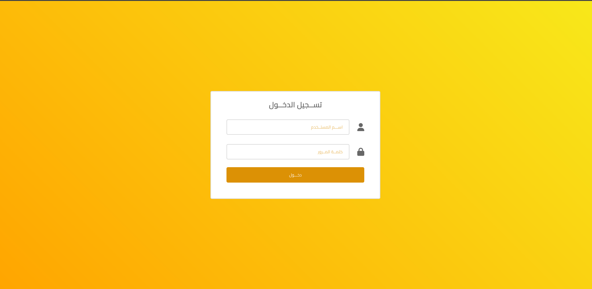

### 📋 day Sales Report 
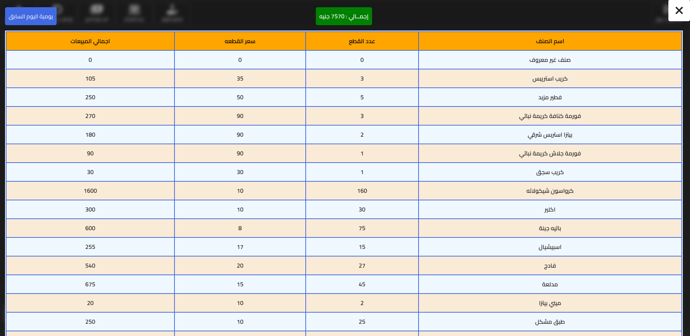
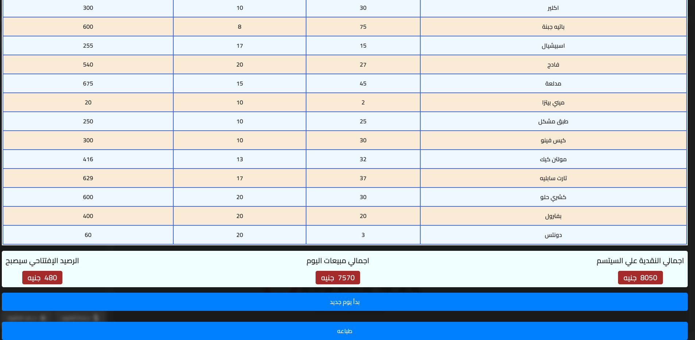

### 🧾 Random Screenshotss

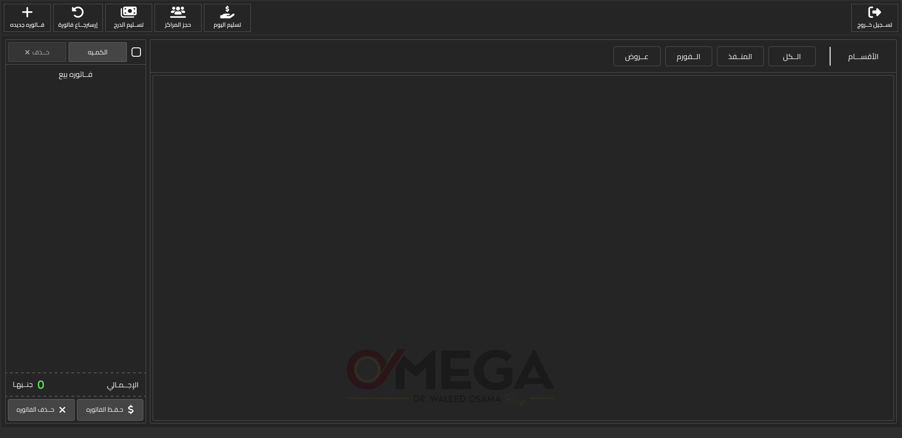
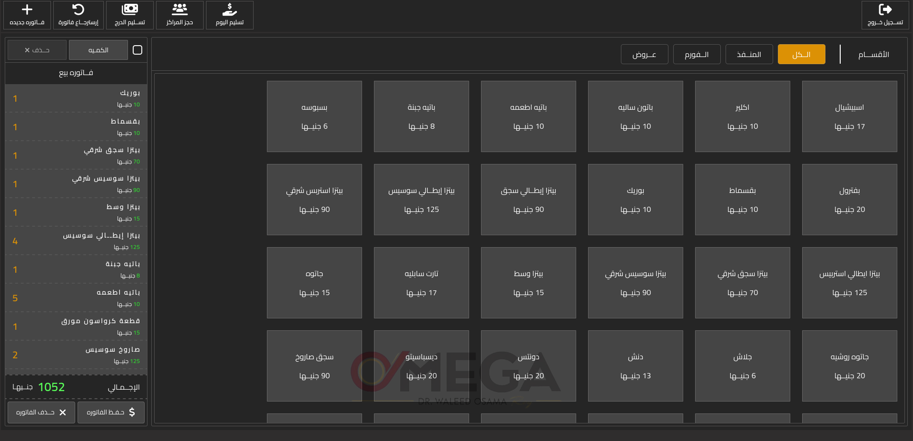
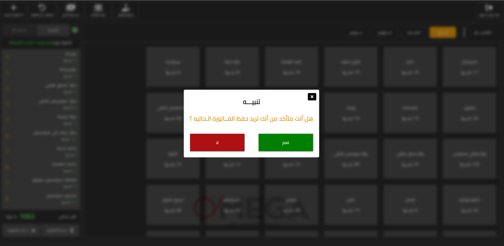
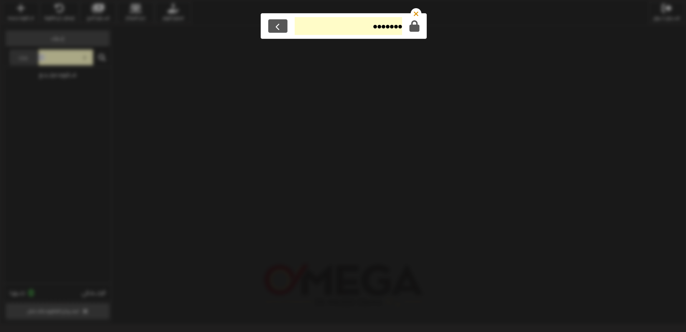
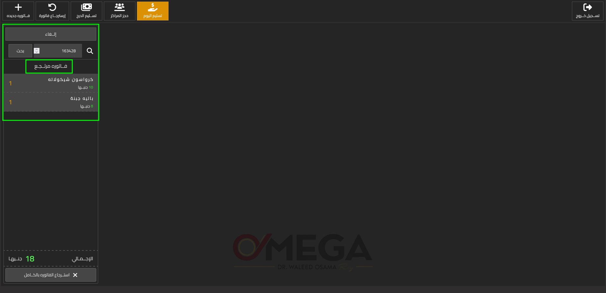

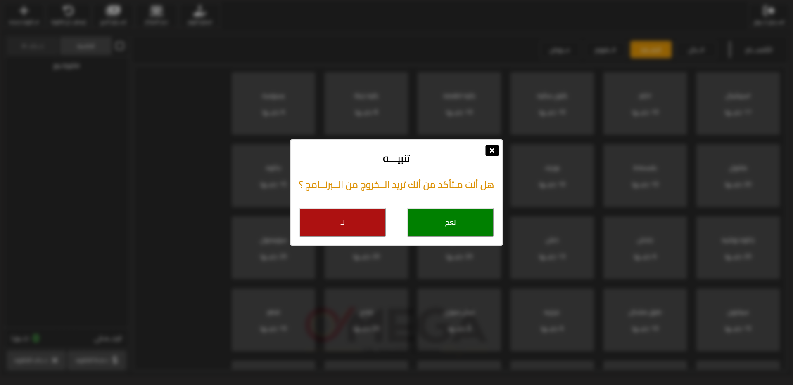
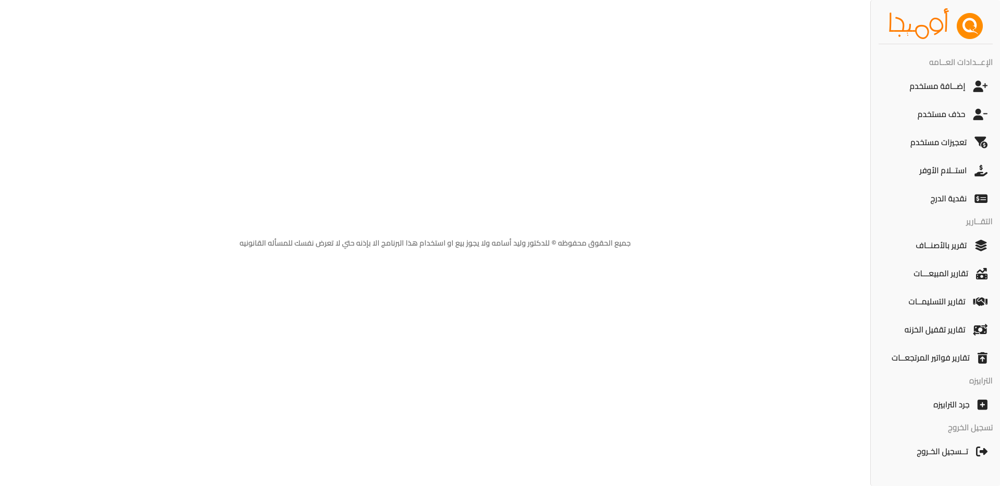
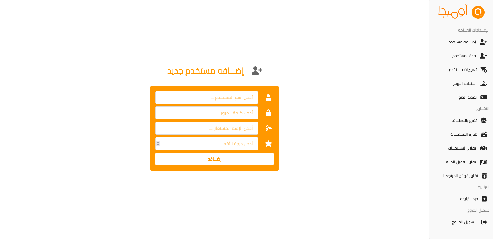
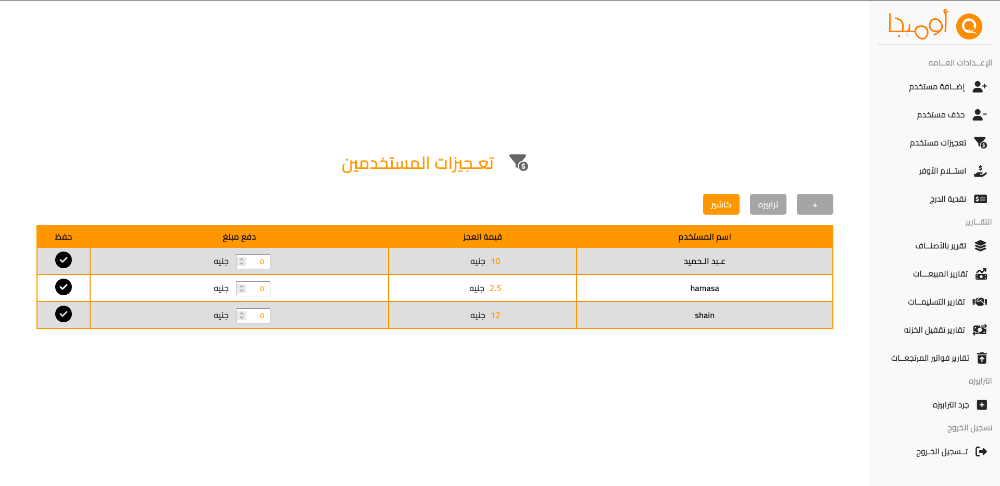
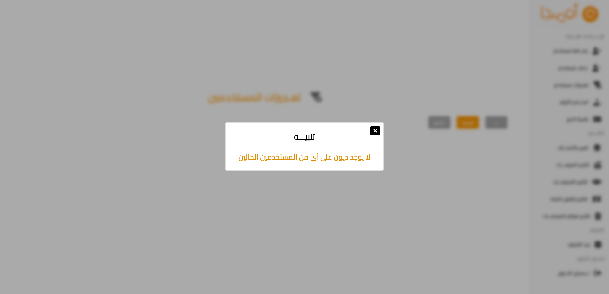
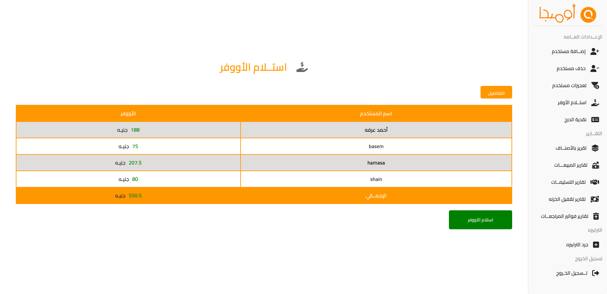
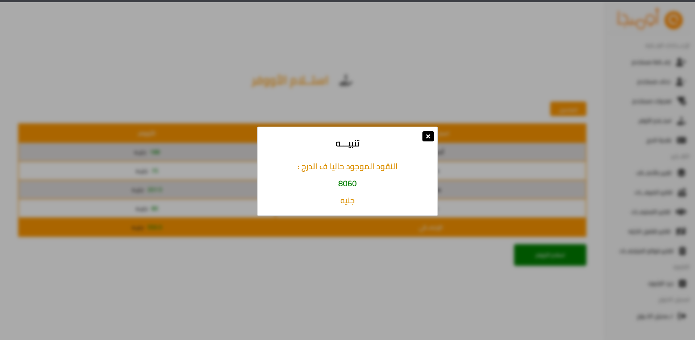
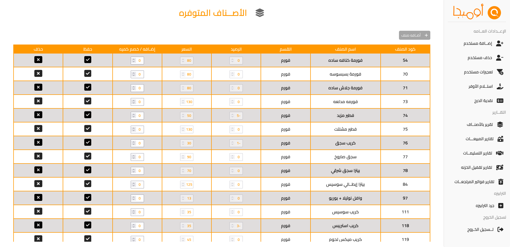
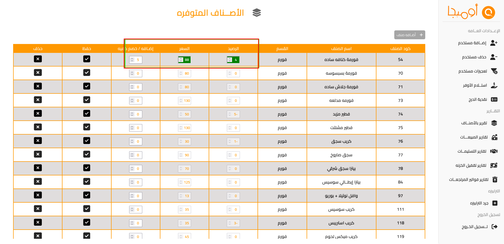
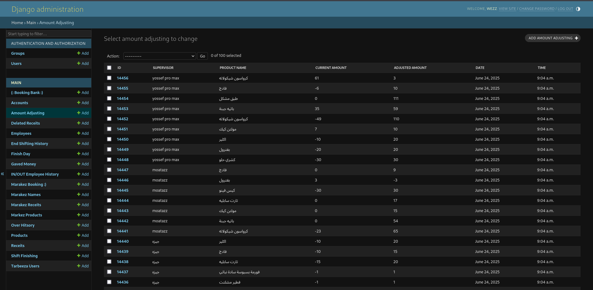
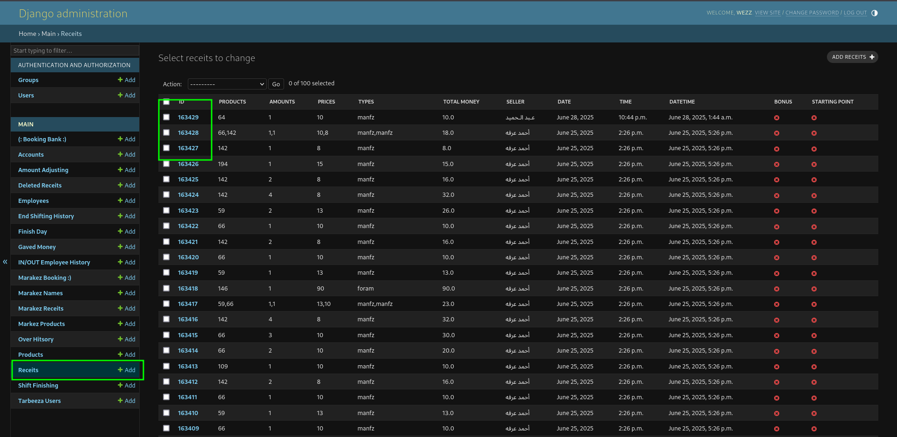
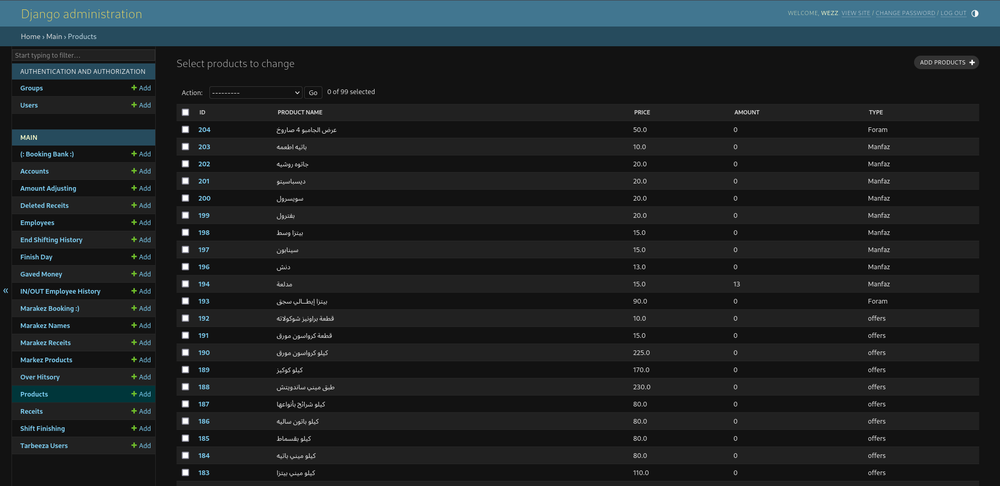
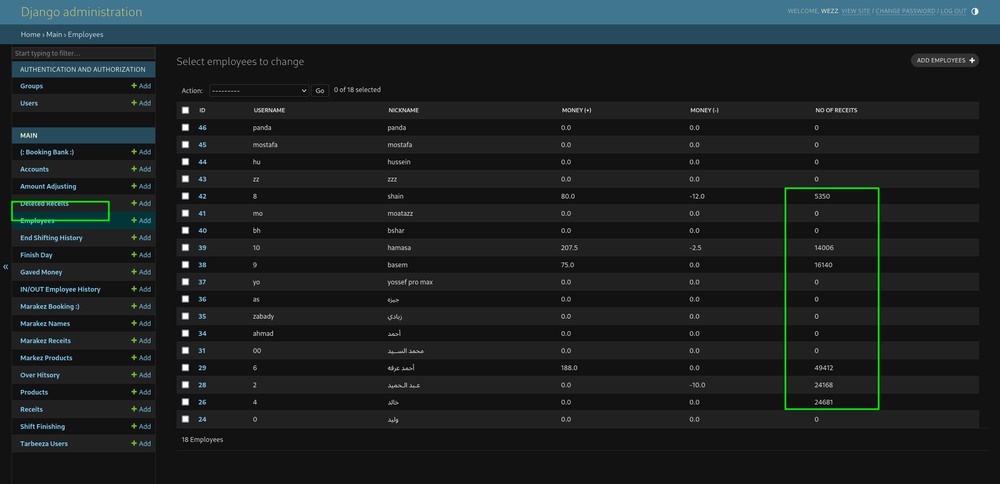

---

